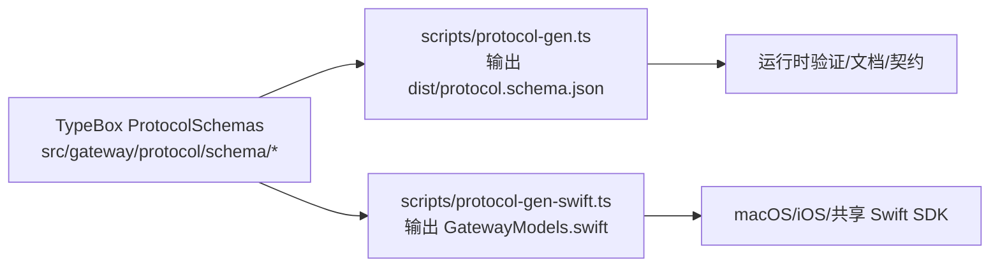
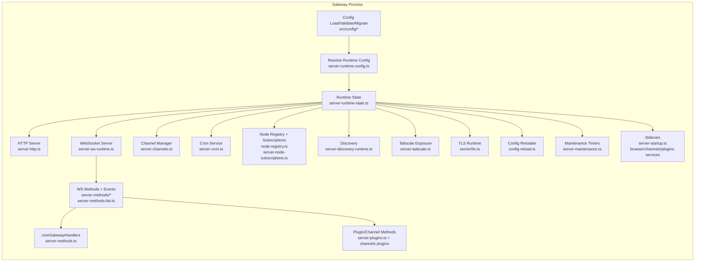

# Clawdbot 工程结构与架构详解（struct.md）

> 适用对象：第一次接手/二开 Clawdbot 的工程同学。  
> 目标：尽可能覆盖“所有代码”的功能边界与关键实现链路，并给出前端/后端/客户端节点的一致架构图。  
> 说明：仓库体量很大（`src/` 约 2k+ TS 文件 + `apps/*` 原生端 + `extensions/*` 插件包）。本文采取“**全量目录归类覆盖 + 关键入口深读**”策略：所有目录都做职责映射；对运行链路的入口与核心子系统做深入到代码级的解释；并明确指出可能需要进一步下钻的“深水区”。

---

## 0. 小白版导读（建议先看这一节）

如果你是第一次接触这类工程，可以先用下面这几段“人话”把系统概念建立起来，然后再回去看第 1~11 节的技术细节。

### 0.1 用 3 句话理解 Clawdbot

- **它就是一个“家里常开着的 AI 助手服务”**：你把它跑在家里的电脑/服务器上，它一直在线。
- **它通过一个“总开关/总控台”统一管理一切**：这个总控台叫 **Gateway（网关/控制面）**。手机、浏览器页面、电脑 App、各种聊天软件都通过它连接。
- **你和它说话的方式有很多**：可以在 WhatsApp/Telegram/Slack 等聊天软件里发消息，也可以用浏览器 WebChat 对话，也可以用命令行（CLI）发指令。

### 0.2 你只需要先记住 5 个“角色”

- **Gateway（网关）**：整个系统的“总机/中控”。默认只在本机 `127.0.0.1:18789` 上监听。
- **CLI（命令行 clawdbot）**：你的“遥控器”。用它安装、配置、启动/停止网关、查看状态、发消息。
- **WebChat / Control UI（网页控制台）**：一个网页界面，能看状态、改配置、管理渠道、直接聊天。
- **Channel（渠道）**：你在哪个平台跟它说话（WhatsApp/Telegram/Discord/...）。每个渠道都有“接入适配器”。
- **Node（节点）**：你的设备（手机/电脑）作为“能力提供者”连上网关，比如相机、屏幕录制、语音唤醒等能力。

> 你看到的“agent / session / plugin / tool / sidecar”等词，先不用怕：下面有术语表（0.5）。

### 0.3 从 0 到“能用”的最短路线（不看代码也能理解）

1. **安装并跑起来**：用 `clawdbot onboard` 跟着向导配置，然后 `clawdbot gateway ...` 启动网关。
2. **先选一个渠道接入**（最简单通常是 Telegram bot 或 WebChat）：配好 token/账号后，测试能收发消息。
3. **确认安全策略**：默认模式下，陌生人 DM 需要“配对/批准”才会被处理（避免任何人随便控制你的助手）。
4. （可选）**出差手机遥控**：不要把网关直接暴露到公网；推荐用 **Tailscale Serve** 或 SSH 隧道来远程访问（见 0.6）。

### 0.4 这份文档怎么读（不迷路）

- **只想知道“它怎么跑起来/怎么用”**：看第 2 节（运行与构建）+ 第 7 节（安全）。
- **只想知道“前端是什么、怎么连后端”**：看第 4.3 节（Web 前端架构图）。
- **只想知道“手机 App 在里面是干嘛的”**：看第 8.3 节（原生端职责）+ 第 4.1（系统上下文图）。
- **要开始改代码**：按第 9.1 的阅读顺序，从入口文件一路跟进去。

### 0.5 术语表（看到这些词别慌）

| 词 | 小白解释 | 在这仓库里大概在哪 |
|---|---|---|
| Gateway（网关/控制面） | “总机/总控台”，负责连接、路由、鉴权、提供 UI、管理渠道与工具 | `src/gateway/*` |
| WS / WebSocket | 一种“长连接”，浏览器/客户端连上后可以实时双向通信（像一直保持通话） | Gateway 主通道 |
| HTTP | 你熟悉的网页请求（打开页面/请求接口） | `src/gateway/server-http.ts` |
| Protocol（协议） | 约定“WS 里消息长什么样” | `src/gateway/protocol/*` |
| agent（代理/助手实例） | 可以理解为“一个助手人格/配置集合”，比如工作助手/生活助手 | `src/agents/*` |
| session（会话） | 一段对话的“历史记录 + 状态”，不同群/不同渠道可分不同 session | `src/sessions/*`、`src/routing/*` |
| tool（工具） | 让 AI 能做事的能力（比如浏览器、发消息、定时任务、读写文件等） | `src/agents/pi-tools.ts` 等 |
| plugin（插件） | 可选扩展包：新增渠道/工具/服务/CLI 命令 | `src/plugins/*`、`extensions/*` |
| sidecar（边车服务） | “同一进程/同一套系统里附带的小服务”，比如浏览器控制 server、发现服务等 | `src/gateway/server-startup.ts` 等 |
| allowlist / pairing | “只让谁能用” + “陌生人要先申请配对才能被处理” | `src/channels/*`、`src/pairing/*` |

### 0.6 出差/手机遥控时，如何避免“网关暴露”

你可以把这个记成一句话：**网关只监听本机（loopback），远程访问走安全通道**。

- **推荐：Tailscale Serve（tailnet 内访问）**
  - Gateway 仍然 `bind: loopback`（不在局域网/公网开端口）
  - 用 Tailscale 把手机与家里机器加入一个私有网络，再通过 Serve 转发访问
- **备选：SSH 隧道**
  - Gateway 仍然只监听本机
  - 你用手机的 SSH 客户端连回家里机器做端口转发
- **尽量避免：直接 `bind lan` 或公网端口转发**
  - 一旦配置错误，你可能把控制面直接暴露给公网，风险很高

---

## 1. 总览：这是一套什么系统？

**一句话**：Clawdbot 是一个“运行在你自己设备上的个人 AI 助手平台”，用一个 **Gateway（控制面，类似总机/中控）** 把多渠道消息、工具、会话/多 agent、Web UI、以及 macOS/iOS/Android 节点统一起来。

核心形态：

- **后端（Node/TS）**：`src/gateway/*`（“总机本体”：负责连接、鉴权、路由、对外提供 WS/HTTP 接口，把所有功能拼起来）
- **CLI（Node/TS）**：`src/cli/*`、`src/commands/*`（“遥控器”：你用命令行来安装/配置/启动/排障）
- **Web 前端（Lit + Vite）**：`ui/*`（“网页控制台”：在浏览器里看状态、改配置、直接聊天；网页本身由网关托管）
- **原生客户端（Swift/Kotlin）**：`apps/macos`、`apps/ios`、`apps/android`（“设备端能力”：让手机/电脑把相机/屏幕/语音等能力提供给网关）
- **插件/扩展（workspace packages）**：`extensions/*`（“可插拔扩展”：给系统加新渠道/新工具/新服务/新命令）

---

## 2. 运行与构建（工程入口）

### 2.1 运行时与包管理

- **Node**：`>= 22.12.0`（根 `package.json -> engines.node`）
- 包管理：推荐 `pnpm`（也支持 npm/bun）

### 2.2 典型运行（从用户视角）

Clawdbot 推荐通过 CLI onboarding 启动网关并配置渠道：

- `clawdbot onboard --install-daemon`
- `clawdbot gateway --port 18789 --verbose`

> 默认 Gateway 端口 **18789**（见 `src/gateway/server.impl.ts` 的默认参数；CLI 也会从 config 解析端口）。
>
> 小白解释：你可以把 `clawdbot gateway ...` 理解成“把总机开机”。只要总机开着，网页、手机、聊天渠道才能连进来。

### 2.3 从源码构建（开发视角）

根脚本（见根 `package.json`）：

- `pnpm install`
- `pnpm ui:build` → 构建 Web UI 到 `dist/control-ui/`
- `pnpm build` → `tsc` 编译到 `dist/`，并执行一些拷贝/写入 build info 的脚本
- `pnpm gateway:watch` → 开发时热更新网关

### 2.4 协议生成（后端 ↔ 原生端共享）

协议单源（TypeBox）→ 生成 JSON Schema → 生成 Swift 模型：

- 源：`src/gateway/protocol/schema/protocol-schemas.ts`（导出 `ProtocolSchemas`，以及 `PROTOCOL_VERSION = 3`）
- JSON Schema：`scripts/protocol-gen.ts` → `dist/protocol.schema.json`
- Swift：`scripts/protocol-gen-swift.ts` →  
  - `apps/macos/Sources/ClawdbotProtocol/GatewayModels.swift`  
  - `apps/shared/ClawdbotKit/Sources/ClawdbotProtocol/GatewayModels.swift`

小白解释：这是“统一口径”。因为 Web 前端、手机 App、macOS App 都要跟网关说同一种“语言”。这套脚本保证大家用的是同一份“字典/协议”，不会各说各话。



---

## 3. 顶层目录结构（“所有代码尽量都了解”的索引）

### 3.1 仓库根目录

- `src/`：**后端主代码**。你理解“系统怎么工作”，基本都在这里找答案。
- `ui/`：**网页控制台代码**。你想改网页、按钮、WebChat 的体验，就看这里；打包后会出现在 `dist/control-ui/`。
- `apps/`：**原生 App**（macOS/iOS/Android）。你想让手机/电脑提供相机/屏幕/语音等能力，就看这里。
- `extensions/`：**扩展插件包**。你想加一个新渠道（比如 Matrix/Zalo/Teams）或新能力，通常以插件形式放这里。
- `docs/`：**文档站内容**（Mintlify）。你作为用户/运维看教程、作为开发看设计说明，会在 docs 里找到更多解释。
- `scripts/`：**构建与维护脚本**。比如协议生成、打包、测试并行等，都是为了“让开发与发布更顺滑”。

### 3.2 `src/` 顶层模块（按职责分组）

下面是 `src/` 目录的“功能地图”（见 `src/` 的实际子目录清单）：

#### 控制面与对外服务
- `src/gateway/`：**网关本体**（系统大脑/总机）。负责“谁连进来、能干什么、消息怎么路由、UI 怎么托管、插件怎么挂载”等。
- `src/web/`：**WhatsApp Web 渠道实现**（用 Baileys 连接 WhatsApp）。你想让“在 WhatsApp 里跟助手说话”，就会走这里。
- `src/slack/`、`src/telegram/`、`src/signal/`、`src/discord/`、`src/imessage/`、`src/line/`：**其他渠道实现**（每个平台都有各自 API/限制，所以每个渠道一套适配）。
- `src/browser/`：**浏览器控制能力**（给 AI 一个“可以操作网页的手”）。例如打开网页、截图、点击输入、下载文件等。
- `src/canvas-host/`：**Canvas 可视化能力**（给 AI 一个“可以画画/展示 UI 的画板”）。A2UI 是一种把 UI 动作/状态传给前端/节点的机制。
- `src/media/`：**临时媒体托管**（把本地图片/音频变成短时间可访问链接，便于某些渠道发送/引用；带 TTL 自动删除）。

#### 代理与运行时（AI、工具、会话）
- `src/agents/`：**AI 助手运行时**（把“你说的话 + 历史对话 + 可用工具”拼起来交给模型；并把模型输出回传到渠道/网页）。
- `src/auto-reply/`：**自动回复流水线**（更偏“消息工程”：收到消息→清洗/分段/权限检查→触发 agent→把回复送回去；很多渠道复用它的套路）。
- `src/sessions/`：**会话存储**（你跟助手聊过什么、当前状态是什么，都需要持久化；这就是 session）。
- `src/routing/`：**路由与隔离规则**（决定“这条消息属于哪个 agent/哪个 session”，比如群聊和私聊分开、不同渠道分开）。

#### 配置、插件、基础设施
- `src/config/`：**配置系统**（读配置文件、校验格式、套默认值、做旧配置迁移；相当于系统的“设置中心”）。
- `src/plugins/`：**插件系统**（发现/加载扩展包，让扩展能加渠道/工具/服务/CLI 命令；相当于“插槽/生态”）。
- `src/infra/`：**基础设施工具箱**（端口、网络、发现、重启策略、Tailscale/Bonjour 等；很多“看起来跟业务无关但必须有”的能力在这）。
- `src/security/`：**安全相关**（审计、外部内容处理策略、Windows 权限修复等；防止被滥用或配置踩坑）。

#### 其它横切能力
- `src/cron/`：**定时任务**（“每天 9 点提醒我…”这种能力）。
- `src/memory/`：**长期记忆/向量记忆**（让助手能“记住一些东西”，也可以用插件替换实现）。
- `src/media-understanding/`、`src/link-understanding/`：**看图/听音/读链接**（把图片/音频/网页链接转成模型能理解的文本/结构；并适配不同 AI/转写 provider）。
- `src/terminal/`、`src/tui/`：**终端交互体验**（让 CLI 更好看更好用：表格、进度条、交互提示）。

---

## 4. 核心架构图（前端 + 后端 + 客户端节点）

### 4.1 系统上下文图（你在外部看到的系统）

小白解释：这张图回答的是“这些东西在现实世界怎么连”：家里机器跑网关；手机/浏览器/电脑通过网络连它；各聊天渠道也通过网关转发消息；网关旁边还有一些“辅助小服务”（浏览器控制、画板、媒体托管、插件）。

```mermaid
flowchart TB
  subgraph UserDevices[用户设备]
    Phone[手机\n(iOS/Android)]
    Mac[macOS 菜单栏 App\n+ Node Mode]
    BrowserUI[浏览器\nControl UI/WebChat]
    CLI[CLI: clawdbot]
  end

  subgraph GatewayHost[家里/服务器（网关宿主机）]
    GW[Gateway\nWS + HTTP\n默认 127.0.0.1:18789]
    BrowserSrv[Browser Control Server\nloopback HTTP]
    Canvas[A2UI/Canvas Host\nHTTP + WS Upgrade]
    MediaSrv[Media Host\nTTL 临时文件]
    Plugins[Plugins/Extensions\nchannels/tools/services]
  end

  subgraph Channels[外部消息渠道]
    WhatsApp[WhatsApp Web\n(Baileys)]
    Telegram[Telegram Bot API]
    Slack[Slack Socket Mode + HTTP]
    Discord[Discord Bot API]
    Signal[signal-cli]
    iMessage[iMessage/macOS]
    Others[扩展渠道\nMatrix/Teams/Zalo/...]
  end

  BrowserUI <-->|WebSocket Protocol v3| GW
  CLI <-->|WS RPC| GW
  Mac <-->|WS Protocol v3| GW
  Phone <-->|WS Protocol v3| GW

  GW --> Plugins
  GW --> BrowserSrv
  GW --> Canvas
  GW --> MediaSrv

  WhatsApp <--> GW
  Telegram <--> GW
  Slack <--> GW
  Discord <--> GW
  Signal <--> GW
  iMessage <--> GW
  Others <--> GW
```

### 4.2 Gateway 内部组件图（后端“怎么拼起来的”）

Gateway 的真实实现入口是 `startGatewayServer()`（`src/gateway/server.impl.ts`）。它把如下模块拼装成一个进程：

小白解释：这张图回答“网关开机时都干了什么”。你可以把它理解成：读取配置 → 创建 HTTP/WS 服务 → 把所有功能（渠道、节点、定时任务、插件等）挂上去 → 开始对外工作。



### 4.3 Web 前端架构图（Control UI/WebChat）

Web UI 在 `ui/`，使用 Lit（Web Components）+ Vite 构建；构建产物输出到 `dist/control-ui/`（见 `ui/vite.config.ts`），由 Gateway 的 `handleControlUiHttpRequest()` 托管（见 `src/gateway/control-ui.ts`）。

小白解释：网页不是单独部署的，它其实是“网关自己带的网页”。你打开网页时访问的是网关；网页再用 WebSocket 去调用网关方法（比如拉状态、发消息、改配置）。

```mermaid
flowchart TB
  subgraph WebUI[Control UI/WebChat (ui/)]
    App[ClawdbotApp\nui/src/ui/app.ts]
    Views[views/*\nchat/overview/channels/nodes/logs/...]
    Ctrls[controllers/*\nchat/channels/config/nodes/...]
    GWClient[GatewayBrowserClient\nui/src/ui/gateway.ts]
    DeviceId[Device Identity\nui/src/ui/device-identity.ts\ned25519 + SHA256 fingerprint]
  end

  subgraph GatewaySide[Gateway]
    HTTP[HTTP static serve\nsrc/gateway/control-ui.ts]
    WS[WS Protocol v3\nsrc/gateway/server-ws-runtime.ts]
    Auth[Gateway auth\nsrc/gateway/auth.ts\n+ device token]
  end

  App --> Views
  Views --> Ctrls
  Ctrls --> GWClient
  GWClient --> DeviceId

  HTTP --> App
  GWClient <-->|WebSocket req/res/event\nProtocol v3| WS
  WS --> Auth
```

关键实现细节（代码级）：

- **静态资源托管与 SPA fallback**：`src/gateway/control-ui.ts`
  - `resolveControlUiRoot()` 搜索 `control-ui` 资源目录（可在 packaged / dist / source / cwd 下工作）
  - `handleControlUiHttpRequest()` 支持 basePath、asset 路径解析、`index.html` 注入 `window.__CLAWDBOT_CONTROL_UI_BASE_PATH__` 等
- **设备身份**：`ui/src/ui/device-identity.ts`
  - 私钥随机生成，公钥计算，`deviceId = SHA-256(publicKey)` 的 hex 指纹
  - 存储在 `localStorage("clawdbot-device-identity-v1")`
- **WS connect 握手 + challenge**：`ui/src/ui/gateway.ts`
  - 先连 WS，收 `connect.challenge`（nonce）再发 `connect`
  - `connect` params 里包含 `minProtocol/maxProtocol=3`、client info、role/scopes、device 签名信息
  - 设备 token 会写回本地（用于后续免密连接）

小白解释：这里的“握手/挑战”就是“先确认你是谁”。网关会先给网页一个随机数（nonce），网页用自己的私钥签名回去，证明“我就是我”，这样更安全。

---

## 5. 关键链路详解（“消息怎么进来、怎么跑到模型、怎么回去”）

### 5.1 路由：channel/account/peer → agentId/sessionKey

路由核心：`src/routing/resolve-route.ts`

- 输入：`channel`、`accountId`、`peer(dm|group|channel)`、`guildId`、`teamId`
- 输出：`agentId`、`sessionKey`（持久化/并发 key）、`mainSessionKey`、`matchedBy`
- 匹配优先级：peer > guild > team > account > channel > default

这决定了：

- 同一个人不同渠道可以落到不同 session
- 群聊/频道可以独立 session（并配合 tool policy / sandbox 做隔离）

小白解释：为什么要路由？因为你可能同时在“群聊”和“私聊”里用它，还可能同时接入多个渠道。路由就是告诉系统：这条消息应该进哪个“对话抽屉/会话”，避免混在一起。

### 5.2 Gateway 网络面：WS + HTTP

#### WS（控制面）

- 建立连接后，所有操作都以 `req/res/event` frame（Protocol v3）传输
- 方法实现集中在 `src/gateway/server-methods/*`，列表在 `src/gateway/server-methods-list.ts`
- 广播事件通过 `broadcast(...)` 发到所有或部分订阅者（例如 heartbeat/health/cron/node events）

小白解释：WS 就像“电话一直不挂断”。好处是网关可以实时推送：比如模型在流式输出、节点上线下线、定时任务触发、状态变化等。

#### HTTP（“同端口多路复用”）

`src/gateway/server-http.ts` 的 `createGatewayHttpServer()` 按顺序处理：

1. hooks（`/hooks/*`，带 token 校验）
2. tools invoke HTTP（工具 HTTP 调用面）
3. Slack HTTP
4. 插件 HTTP handler（如果有）
5. OpenAI 兼容接口（可配置开关）
6. Canvas/A2UI HTTP
7. Control UI 静态资源
8. 404

小白解释：HTTP 就像“开网页/点接口”。网关同一个端口既负责“网页静态资源”，也负责一些“外部触发接口”（hooks）和“兼容 OpenAI 的接口”，所以看起来路径很多。

### 5.3 渠道：内置渠道 + 插件渠道

渠道分为两类：

- **内置**：在 `src/telegram`、`src/slack`、`src/discord`、`src/web(WhatsApp)`、`src/signal`、`src/imessage`、`src/line` 等
- **扩展**：在 `extensions/*`（以插件形式注入 channelIds、gatewayMethods、cliCommands、services 等）

`src/channels/registry.ts` 提供了“可展示的渠道 meta”（用于选择 UI/文案、docsPath、aliases 等），并强调不要在共享层直接 import 重实现，改用 plugin registry 延迟加载。

小白解释：每个渠道都有自己的规则（消息格式、@提醒、权限、文件大小限制……）。所以工程里会按渠道拆开。你想“在哪个 App 里聊天”，就看那个渠道目录。

### 5.4 Agent Runtime：Pi 运行时 + 工具系统 + 沙箱

Agent 的核心职责是：把“消息上下文 + 可用工具 + 模型配置”拼成一次 run，并将流式输出与工具调用通过 Gateway 回传。

小白解释：你可以把 agent 当成“真正干活的助手”。网关负责接电话和分发；agent 负责理解你的话、必要时调用工具（比如读文件/查网页/发消息），然后把回复交回网关发送出去。

关键文件：

- 系统提示词拼装：`src/agents/system-prompt.ts`
  - 将工具说明、workspace、docs、sandbox 信息等注入 system prompt
- 工具创建与策略过滤：`src/agents/pi-tools.ts`
  - `createClawdbotCodingTools()` 组合：
    - 基础 coding tools（read/write/edit 等）
    - exec/process（支持后台、审批、sandbox 容器执行）
    - channel-defined agent tools（例如登录工具）
    - clawdbot 内建工具（browser/canvas/nodes/cron/message/gateway/...）
  - 关键：通过多层 policy 过滤（global/agent/group/provider/profile/sandbox/subagent）
  - 插件工具也会以“group”形式注入 allowlist（`buildPluginToolGroups`）
- 嵌入式 runner：`src/agents/pi-embedded.ts`（导出 run/queue/compact 等）

### 5.5 Browser/Canvas/Nodes：工具与 sidecar 的组合

#### Browser 控制（loopback 本地服务）

入口：`src/browser/server.ts`

特性：

- 只在 `127.0.0.1` 上监听（本地控制面），通过 Gateway 触发或直接工具调用
- 若配置的 `browser.controlUrl` 是非 loopback，会“跳过本地 server 启动”（避免误在本机再开一层）
- 支持 profile（本地 Chrome/Playwright/extension relay driver）、并在 extension driver 下启动 relay server

小白解释：Browser 这块就是“让 AI 会上网操作”。但为了安全，控制服务默认只开在本机（127.0.0.1），不建议把它直接暴露到公网/局域网。

#### Canvas Host（A2UI）

目录：`src/canvas-host/*`

Gateway HTTP upgrade 时会把 canvas 的 upgrade 优先处理（见 `src/gateway/server-http.ts` 的 `attachGatewayUpgradeHandler()`）。

小白解释：Canvas 更像“一个可视化小黑板”。当你需要更直观的展示（图、表、交互 UI）时，agent 可以把内容推到 Canvas。

#### Nodes（原生设备节点）

Gateway 侧：

- `src/gateway/node-registry.ts`：注册节点、发送事件、`node.invoke` 调用与结果回传
- `src/gateway/server-node-subscriptions.ts`：session 订阅 node events

客户端侧（摘要）：

- iOS/macOS 多用 `URLSessionWebSocketTask`；Android 用 OkHttp WebSocket
- discovery：Bonjour/mDNS（LAN）+ wide-area discovery（可配合 Tailscale）
- 配对：connect 握手 + device token 下发（UI 侧有设备 token 存储逻辑）

小白解释：Node 就是“把设备能力接进来”。比如手机的相机、屏幕录制、位置。网关不会凭空获得这些能力，必须有设备连上来当节点。

### 5.6 临时媒体托管（Media Host）

用途：某些渠道/工具需要对外提供可访问 URL（例如将本地媒体变成短期可访问链接）。

小白解释：有些平台发图片/音频时，内部会需要一个“可访问的链接”。这模块就是临时把本地文件变成短期 URL，用完自动删，减少长期暴露风险。

代码：

- `src/media/server.ts`：`GET /media/:id`，TTL 过期即删除；路径安全校验：
  - `realpath` + `startsWith(mediaRoot)` 防目录穿越
  - 拒绝 symlink
  - 单次下载后尽快删除（finish 后延迟清理）
- `src/media/host.ts`：`ensureMediaHosted()`：
  - 若端口未占用且要求 `startServer` 则启动本地临时 server
  - URL 形如 `https://${hostname}/media/${id}`（hostname 来自 `getTailnetHostname()`）
  - 注释/报错提示强调：需要 webhook/Funnel server（即需要某种可达入口）

---

## 6. 插件系统（extensions/* 如何“长”进核心）

插件加载入口：`src/plugins/loader.ts`（`loadClawdbotPlugins()`）

小白解释：插件系统就是“插U盘扩容”。核心系统留一套接口，插件往里插就能增加新能力（新渠道、新工具、新命令），你不需要改核心代码就能扩展。

关键机制：

- **发现**：`discoverClawdbotPlugins()` 收集候选（workspaceDir + extra paths）
- **manifest**：`loadPluginManifestRegistry()` 读取 `clawdbot.plugin.json` 等元信息（含 config schema/ui hints）
- **加载执行**：使用 `jiti` 动态加载 TS/JS 模块
  - 并注入 alias：`clawdbot/plugin-sdk` 指向仓库内的 plugin-sdk（src 或 dist，按运行环境决定）
- **启用策略**：`resolveEnableState()` 根据 config 决定启用/禁用原因
- **配置校验**：`validateJsonSchemaValue()` 校验插件 config（插件必须有 schema，否则报错）
- **slot 选择**：memory 插件 slot 只能选一个（`resolveMemorySlotDecision()`）
- **输出 registry**：包含 plugin 的 tools、hooks、channelIds、providerIds、gatewayMethods、cliCommands、services 等能力声明

小白解释：registry 就是“插件说明书”。网关看说明书就知道这个插件提供了哪些东西：能不能加一个新渠道？有没有新工具？有没有新 HTTP 入口？

插件 CLI 命令注册：

- `src/plugins/cli.ts`：`registerPluginCliCommands()` 将插件的 CLI registrar 注册到 Commander program

插件对 Gateway 的注入点（高层）：

- Gateway 启动时 `loadGatewayPlugins(...)`（`src/gateway/server.impl.ts`）合并 plugin gateway methods + handlers
- Channel plugins 也可以提供 `gatewayMethods`

---

## 7. 安全与暴露面（工程级风险边界）

### 7.1 Gateway 绑定与鉴权（核心边界）

CLI 启动逻辑（`src/cli/gateway-cli/run.ts`）有硬约束：

- 默认 bind `loopback`
- 若 bind 不是 loopback，会 **拒绝在无 shared secret（token/password）时启动**

小白解释：这是在防止你“误操作把总机开到公网”。如果你把网关监听改成局域网/外网可达，系统会强制要求你设置密码/令牌，否则直接拒绝启动。

Gateway 鉴权逻辑（`src/gateway/auth.ts`）要点：

- 支持 `token` / `password`
- `allowTailscale`：当 tailscale mode=serve 且 auth mode != password 时可能允许 tailscale 身份认证路径
- `isLocalDirectRequest()`：在可信代理与 loopback/ts.net host 组合下判定“本地直连”
- `authorizeGatewayConnect()`：优先 tailscale verified user（在 allowTailscale 且非 localDirect 时），否则走 token/password

### 7.2 Control UI 的“安全上下文”要求

Web UI 的设备身份签名依赖 `crypto.subtle`（安全上下文：HTTPS/localhost）。`ui/src/ui/gateway.ts` 里明确：

- 非安全上下文会跳过 device identity，只能退化到 token-only auth（并可能被 Gateway 拒绝，除非开启允许不安全认证的配置项）

小白解释：网页要用浏览器里的加密能力（crypto.subtle）来生成/保存“设备身份”。如果你用不安全的 HTTP 打开网页，这些能力可能不可用，安全性会下降，所以系统会更严格。

### 7.3 工具执行与沙箱

`src/agents/pi-tools.ts` 与相关 policy 模块体现的安全策略：

- 对 group/non-main session 可设置更严格 tool allowlist（并可配合 Docker sandbox）
- 对 subagent 继承/限制工具集合
- `exec` 支持 ask/approval（审批流在 Gateway 侧也有 exec approvals 管理）

小白解释：工具里最危险的是“执行命令”（exec）。沙箱/审批就是为了：即使有人在群里诱导机器人执行危险命令，也尽量拦住或需要你批准。

### 7.4 临时媒体托管的暴露风险

`src/media/host.ts` 生成的 URL 是 `https://${tailnetHostname}/media/...`，意味着往往依赖某种外部可达入口（例如 Tailscale Serve/Funnel 或 webhook 服务）。此处要特别注意：

- 这类 URL 通常具备“可访问性”，因此 TTL、访问控制、暴露范围要严格管理

小白解释：一旦出现 URL，就意味着“拿到链接的人可能能访问”。所以必须短时有效（TTL）并尽量只在你的小圈子网络里可访问。

---

## 8. 前后端分工与边界（把“前端/后端”说清楚）

### 8.1 后端（Node/TS）主要职责

- 网关通信与控制面（WS + HTTP）
- 配置与状态：健康、presence、sessions、cron、tools、plugins
- 渠道连接与消息收发（多渠道 adapter）
- agent runtime 驱动（Pi runtime、工具过滤、模型选择与 fallback）
- sidecars：browser server、canvas host、插件服务、发现、tailscale 暴露

小白解释：后端负责“真正干活 + 安全控制”。前端只是一个控制界面，本质是调用后端提供的能力。

### 8.2 Web 前端（Control UI/WebChat）主要职责

- Operator 角色的“控制台”：overview、channels、sessions、cron、skills、nodes、logs、debug 等
- WebChat：对话 UI、流式消息展示、会话切换
- 设备身份管理（ed25519）与设备 token 存储
- 通过 WS Protocol v3 调用 Gateway methods 并订阅 event

小白解释：网页不直接连接 WhatsApp/Telegram 等渠道，它只连网关。网关负责跟各渠道打交道。

### 8.3 原生端（macOS/iOS/Android）主要职责

- 作为节点/客户端连接 Gateway：发现、握手、认证、重连、心跳
- 暴露设备能力：canvas、camera、screen record、voice wake/talk mode、location（以及 Android 的 SMS 等）
- macOS 还负责本地菜单栏管理、可能的 gateway 进程管理等

小白解释：原生端更多是“设备能力”和“好用的入口”。真正的消息路由/权限/模型调用还是在网关端。

---

## 9. 渐进式阅读建议（如果你要继续“深入到每个子系统”）

### 9.1 推荐阅读顺序（最短路径理解全局）

1. `src/cli/run-main.ts` → CLI 启动与命令注册入口
2. `src/gateway/server.impl.ts` → Gateway 组装入口（“所有后端组件的总装”）
3. `src/gateway/server-http.ts` + `src/gateway/server-ws-runtime.ts` → 网络面（HTTP/WS）
4. `src/gateway/server-methods-list.ts` + `src/gateway/server-methods/*` → 控制面 API 全集
5. `src/routing/resolve-route.ts` → 路由与 sessionKey
6. `src/agents/pi-tools.ts` + `src/agents/system-prompt.ts` → agent runtime 与工具系统
7. `ui/src/ui/gateway.ts` + `ui/src/ui/app.ts` → WebChat/Control UI 与鉴权握手
8. `src/plugins/loader.ts` → 插件如何被发现/加载/校验/注入
9. `apps/shared/ClawdbotKit/*` → 节点端协议与连接抽象（再下钻各平台实现）

小白解释：这条顺序就是“从总入口到分支”。你跟着读，不会在 2000+ 文件里迷路：先看入口文件，再看网关怎么拼装，再看具体功能模块。

### 9.2 深水区（通常需要专门专题）

- WhatsApp(Web)/auto-reply 全链路：`src/web/*`、`src/auto-reply/*`
- Browser 工具链：`src/browser/pw-*`、`src/browser/routes/*`、CDP/extension relay
- Media-understanding / link-understanding：多 provider 的转写/视觉/链接解析链路
- Sandbox/Docker 执行策略与审批：`src/agents/sandbox*` + Gateway exec approvals
- 各渠道的具体消息规范化与 chunking/typing/pairing：`src/channels/*` + `src/*(channel)`

---

## 10. 关键文件索引（用于快速定位）

### 10.1 后端 / 网关
- `src/gateway/server.impl.ts`：`startGatewayServer()` 总装入口
- `src/gateway/server-http.ts`：HTTP 路由分发（hooks/tools/openai/control-ui/canvas）
- `src/gateway/control-ui.ts`：Control UI 静态资源托管 + SPA fallback + 注入 basePath/name/avatar
- `src/gateway/auth.ts`：token/password/tailscale 鉴权与可信代理判断
- `src/gateway/server-methods/*`：WS methods 实现（agent/chat/sessions/nodes/config/cron/...）
- `src/gateway/protocol/schema/protocol-schemas.ts`：ProtocolSchemas + PROTOCOL_VERSION

小白解释：如果你只想“确认某个功能到底在哪里实现”，就先来这节搜文件名。比如你想知道网页怎么被托管，就看 `control-ui.ts`；想知道鉴权，就看 `auth.ts`。

### 10.2 CLI / 配置 / daemon
- `src/cli/run-main.ts`：CLI 入口（dotenv/env/runtime guard/lazy subcli/plugin cli）
- `src/cli/program/*`：Commander program 构建与命令注册
- `src/config/*`：配置 IO/验证/默认值/迁移/include/env substitution
- `src/daemon/*`：launchd/systemd/schtasks 守护进程管理

### 10.3 Web UI（前端）
- `ui/src/main.ts`、`ui/src/ui/app.ts`：入口与主应用
- `ui/src/ui/gateway.ts`：WS client + connect challenge + device identity
- `ui/src/ui/device-identity.ts`：ed25519 身份生成与签名
- `ui/vite.config.ts`：构建输出到 `dist/control-ui/`

### 10.4 工具/sidecar
- `src/browser/server.ts`：浏览器控制服务（loopback）+ routes
- `src/canvas-host/*`：A2UI/Canvas host
- `src/media/server.ts`、`src/media/host.ts`：临时媒体托管与 TTL

### 10.5 插件/扩展
- `src/plugins/loader.ts`：插件发现/加载/校验/registry
- `src/plugins/cli.ts`：插件 CLI 命令注册
- `extensions/*`：插件包（每个包有 `clawdbot.plugin.json` 与 `index.ts`/`src/*`）

---

## 11. 本文之外：如果你要我继续“把每个子系统再展开到更细”

我可以按你关注方向继续渐进式补充 struct.md（每次聚焦一个子系统，深入到入口函数、关键数据结构、错误处理、测试覆盖点）：

- **方向 A**：WhatsApp Web + auto-reply + routing（完整消息流水线）
- **方向 B**：Agent runtime（Pi embedded runner、工具策略、sandbox、subagent、skills）
- **方向 C**：Browser 工具链（Playwright/CDP、profiles、extension relay、截图/role snapshot）
- **方向 D**：Nodes（macOS/iOS/Android）与协议细节（connect/device token/pairing/command map）

