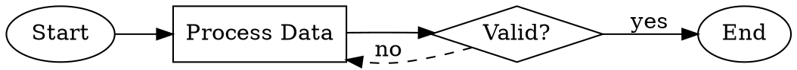

# Excalidraw 流程图 Skill

生成专业级流程图与图表，并保存为可在 Excalidraw 中打开的 .excalidraw 文件。

## 何时使用本 Skill

- 用户要求创建流程图或图表  
- 用户希望对某个流程或工作流进行可视化  
- 用户需要架构图  
- 用户提及 “excalidraw” 或 “流程图”  
- 用户希望记录决策树  

## 前置条件

必须已安装 `@swiftlysingh/excalidraw-cli` 工具：

```bash
npm install -g @swiftlysingh/excalidraw-cli
```

或通过 npx 使用（无需本地安装）：

```bash
npx @swiftlysingh/excalidraw-cli create --inline "DSL" -o output.excalidraw
```

## 如何创建流程图

### 步骤 1：分析请求

从用户描述中识别：
- 主要步骤/节点有哪些？  
- 决策点有哪些？  
- 流向如何？  
- 是否存在循环或分支？  

### 步骤 2：编写 DSL

使用如下 DSL 语法描述流程图：

| 语法 | 元素 | 用途 |
|--------|---------|---------|
| `[Label]` | 矩形 | 表示处理步骤、操作动作 |
| `{Label?}` | 菱形 | 表示判断、条件分支 |
| `(Label)` | 椭圆 | 表示起始点或终止点 |
| `[[Label]]` | 数据库 | 表示数据存储 |
| `![path]` | 图片 | 行内嵌入图片 |
| `` | 定尺寸图片 | 指定宽高尺寸的图片 |
| `->` | 箭头 | 表示连接关系 |
| `-> "text" ->` | 带标签箭头 | 带文字说明的连接线 |
| `-->` | 虚线箭头 | 表示可选路径或替代路径 |

### DSL 指令（Directives）

| 指令 | 描述 | 示例 |
|-----------|-------------|---------|
| `@direction` | 设置整体流向 | `@direction LR` |
| `@spacing` | 设置节点间距 | `@spacing 60` |
| `@image` | 定位图片位置 | `@image logo.png at 100,50` |
| `@decorate` | 为节点添加装饰元素 | `@decorate icon.png top-right` |
| `@sticker` | 从贴纸库添加贴纸 | `@sticker checkmark at 200,100` |
| `@library` | 设置贴纸库路径 | `@library ./assets/stickers` |
| `@scatter` | 在画布上随机散布图片 | `@scatter star.png count:5` |

### 步骤 3：生成文件

运行 CLI 工具生成 .excalidraw 文件：

```bash
npx @swiftlysingh/excalidraw-cli create --inline "YOUR_DSL_HERE" -o flowchart.excalidraw
```

若 DSL 内容为多行，可使用 heredoc 方式：

```bash
npx @swiftlysingh/excalidraw-cli create --inline "$(cat <<'EOF'
(Start) -> [Step 1] -> {Decision?}
{Decision?} -> "yes" -> [Step 2] -> (End)
{Decision?} -> "no" -> [Step 3] -> [Step 1]
EOF
)" -o flowchart.excalidraw
```

### 步骤 4：通知用户

向用户说明：
1. 文件已生成于指定路径  
2. 可在 Excalidraw（https://excalidraw.com）中通过「文件 > 打开」打开该文件  
3. 如需进一步编辑，可在 Excalidraw 中直接操作  

## DSL 示例

### 简单线性流程

```
(Start) -> [Initialize] -> [Process Data] -> [Save Results] -> (End)
```

### 决策树

```
(Start) -> [Receive Request] -> {Authenticated?}
{Authenticated?} -> "yes" -> [Process Request] -> (Success)
{Authenticated?} -> "no" -> [Return 401] -> (End)
```

### 循环/重试模式

```
(Start) -> [Attempt Operation] -> {Success?}
{Success?} -> "yes" -> [Continue] -> (End)
{Success?} -> "no" -> {Retry Count < 3?}
{Retry Count < 3?} -> "yes" -> [Increment Counter] -> [Attempt Operation]
{Retry Count < 3?} -> "no" -> [Log Failure] -> (Error)
```

### 多分支流程

```
(User Input) -> {Input Type?}
{Input Type?} -> "text" -> [Parse Text] -> [Process]
{Input Type?} -> "file" -> [Read File] -> [Process]
{Input Type?} -> "url" -> [Fetch URL] -> [Process]
[Process] -> [Output Result] -> (Done)
```

### 含数据库节点

```
[API Request] -> {Cache Hit?}
{Cache Hit?} -> "yes" -> [[Read Cache]] -> [Return Data]
{Cache Hit?} -> "no" -> [[Query Database]] -> [[Update Cache]] -> [Return Data]
```

## CLI 参数选项

- `-o, --output <file>` — 输出文件路径（默认：flowchart.excalidraw）  
- `-f, --format <type>` — 输入格式：dsl / json / dot（默认：自动识别）  
- `-d, --direction <TB|BT|LR|RL>` — 流向（默认：TB = 自上而下）  
- `-s, --spacing <number>` — 节点间距（单位：像素，默认：50）  
- `--inline <dsl>` — 行内 DSL/DOT 字符串  
- `--stdin` — 从标准输入读取输入内容  
- `--verbose` — 显示详细日志输出  

带参数的使用示例：

```bash
npx @swiftlysingh/excalidraw-cli create --inline "[A] -> [B] -> [C]" --direction LR --spacing 80 -o horizontal-flow.excalidraw
```

## DOT/Graphviz 格式（v1.1.0 新增）

CLI 现已支持 DOT/Graphviz 格式生成图表。适用于已有 DOT 文件场景，或你更偏好使用 DOT 语法的情形。

### DOT 语法示例



### 支持的 DOT 特性

| 特性 | DOT 语法 | 对应元素 |
|---------|-----------|---------|
| 矩形 | `shape=box` 或 `shape=rect` | `[Label]` |
| 菱形 | `shape=diamond` | `{Label}` |
| 椭圆 | `shape=ellipse` 或 `shape=circle` | `(Label)` |
| 数据库 | `shape=cylinder` | `[[Label]]` |
| 流向 | `rankdir=TB\|BT\|LR\|RL` | `@direction` |
| 边标签 | `[label="text"]` | `-> "text" ->` |
| 虚线边 | `[style=dashed]` | `-->` |
| 颜色 | `[fillcolor="..." color="..."]` | 节点样式 |

### 使用 DOT 文件

```bash
# From file (auto-detected by .dot or .gv extension)
npx @swiftlysingh/excalidraw-cli create diagram.dot -o output.excalidraw

# Inline DOT
npx @swiftlysingh/excalidraw-cli create --format dot --inline "digraph { A -> B -> C }" -o output.excalidraw
```

## 图片与装饰元素（v1.1.0 新增）

### 图片节点

将图片作为流程图中的独立元素：

```
(Start) ->  -> [Process] -> (End)
```

### 定位图片

将图片置于画布特定坐标位置：

```
@image background.png at 0,0
@image logo.png near (Start) top-right

(Start) -> [Process] -> (End)
```

### 节点装饰

为节点附加小型图标或徽章：

```
[Deploy to Production]
@decorate checkmark.png top-right

[Review Required]
@decorate warning.png top-left
```

装饰锚点位置：`top`、`bottom`、`left`、`right`、`top-left`、`top-right`、`bottom-left`、`bottom-right`

### 贴纸库

使用预定义的可复用贴纸资源库：

```
@library ./assets/stickers
@sticker success at 100,100
@sticker warning near (Error) top-right
```

### 散布图片（Scatter）

将图片随机分布于整个画布：

```
@scatter confetti.png count:10
@scatter star.png count:5 width:20 height:20
```

## 常见模式

### API 请求流程

```
[Client Request] -> [API Gateway] -> {Auth Valid?}
{Auth Valid?} -> "yes" -> [Route to Service] -> [[Database]] -> [Response]
{Auth Valid?} -> "no" -> [401 Unauthorized]
```

### CI/CD 流水线

```
(Push) -> [Build] -> [Test] -> {Tests Pass?}
{Tests Pass?} -> "yes" -> [Deploy Staging] -> {Manual Approval?}
{Manual Approval?} -> "yes" -> [Deploy Production] -> (Done)
{Manual Approval?} -> "no" -> (Cancelled)
{Tests Pass?} -> "no" -> [Notify Team] -> (Failed)
```

### 用户注册流程

```
(Start) -> [Enter Details] -> {Email Valid?}
{Email Valid?} -> "no" -> [Show Error] -> [Enter Details]
{Email Valid?} -> "yes" -> {Password Strong?}
{Password Strong?} -> "no" -> [Show Password Requirements] -> [Enter Details]
{Password Strong?} -> "yes" -> [[Save to Database]] -> [Send Verification Email] -> (Success)
```

## 使用提示

1. **保持标签简洁** — 使用简短、动词导向的文字  
2. **判断节点结尾加 ?** — 明确标识其为条件分支  
3. **命名保持一致** — 有助于节点去重与识别  
4. **起始节点标注 (Start)** — 清晰标示入口点  
5. **复杂流程建议分步验证** — 必要时拆解为多个子流程  