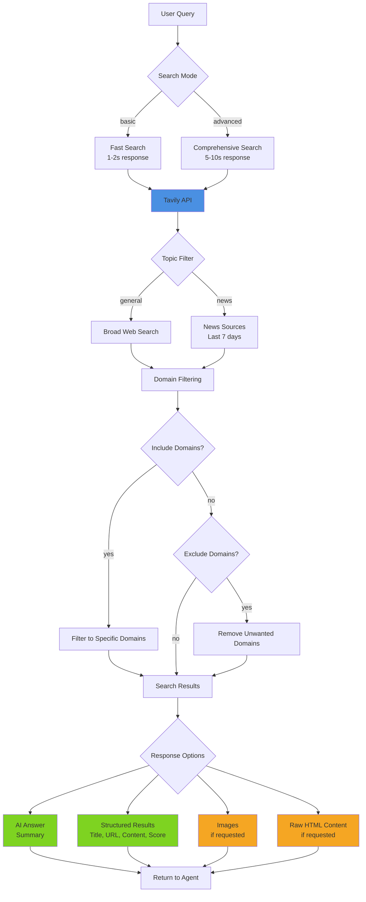

# Tavily AI 搜索

## 概述

Tavily 是一款专为大语言模型（LLM）与 AI 应用优化的搜索引擎。与传统搜索 API 不同，Tavily 提供面向 AI 就绪的结果，支持可选的答案生成、干净的内容提取，以及按领域筛选的能力。

**核心能力：**
- 基于搜索结果生成 AI 答案摘要  
- 结构清晰、专为 LLM 处理优化的结果  
- 快速模式（`basic`）与全面模式（`advanced`）  
- 领域过滤（可指定包含/排除特定信源）  
- 聚焦新闻的搜索，适用于时事事件  
- 图像搜索，返回相关视觉内容  
- 原始内容提取，支持深度分析  

## 架构



## 快速入门

### 基础搜索

```bash
# Simple query with AI answer
scripts/tavily_search.py "What is quantum computing?"

# Multiple results
scripts/tavily_search.py "Python best practices" --max-results 10
```

### 高级搜索

```bash
# Comprehensive research mode
scripts/tavily_search.py "Climate change solutions" --depth advanced

# News-focused search
scripts/tavily_search.py "AI developments 2026" --topic news
```

### 领域过滤

```bash
# Search only trusted domains
scripts/tavily_search.py "Python tutorials" \
  --include-domains python.org docs.python.org realpython.com

# Exclude low-quality sources
scripts/tavily_search.py "How to code" \
  --exclude-domains w3schools.com geeksforgeeks.org
```

### 启用图像搜索

```bash
# Include relevant images
scripts/tavily_search.py "Eiffel Tower architecture" --images
```

## 搜索模式

### 基础模式 vs 高级模式

| 模式 | 速度 | 覆盖范围 | 适用场景 |
|------|------|----------|----------|
| **basic** | 1–2 秒 | 良好 | 快速查证事实、简单查询 |
| **advanced** | 5–10 秒 | 出色 | 研究任务、复杂主题、综合分析 |

**决策树：**  
1. 只需快速获取某个事实或定义？→ 使用 `basic`  
2. 正在研究一个复杂主题？→ 使用 `advanced`  
3. 需要多方观点？→ 使用 `advanced`  
4. 查询具有时效敏感性？→ 使用 `basic`  

### 通用搜索 vs 新闻搜索

| 主题 | 时间范围 | 信源 | 适用场景 |
|------|----------|------|----------|
| **general** | 全时段 | 广泛网页 | 常青内容、教程、文档资料 |
| **news** | 最近 7 天 | 新闻网站 | 时事动态、最新进展、突发新闻 |

**决策树：**  
1. 查询中包含“最新”、“近期”、“当前”、“今日”等词？→ 使用 `news`  
2. 寻找历史资料或常青内容？→ 使用 `general`  
3. 需要最新信息？→ 使用 `news`  

## API 密钥配置

### 方式一：Clawdbot 配置（推荐）

在您的 Clawdbot 配置中添加：

```json
{
  "skills": {
    "entries": {
      "tavily": {
        "enabled": true,
        "apiKey": "tvly-YOUR_API_KEY_HERE"
      }
    }
  }
}
```

在脚本中通过 Clawdbot 的配置系统访问该密钥。

### 方式二：环境变量

```bash
export TAVILY_API_KEY="tvly-YOUR_API_KEY_HERE"
```

添加至 `~/.clawdbot/.env` 或您的 shell 配置文件中。

### 获取 API 密钥

1. 访问 https://tavily.com  
2. 注册账户  
3. 进入仪表板（Dashboard）  
4. 生成 API 密钥（以 `tvly-` 开头）  
5. 查看您所选套餐的速率限制与信用额度分配  

## 常见使用场景

### 1. 研究与事实核查

```bash
# Comprehensive research with answer
scripts/tavily_search.py "Explain quantum entanglement" --depth advanced

# Multiple authoritative sources
scripts/tavily_search.py "Best practices for REST API design" \
  --max-results 10 \
  --include-domains github.com microsoft.com google.com
```

### 2. 时事新闻

```bash
# Latest news
scripts/tavily_search.py "AI policy updates" --topic news

# Recent developments in a field
scripts/tavily_search.py "quantum computing breakthroughs" \
  --topic news \
  --depth advanced
```

### 3. 特定领域研究

```bash
# Academic sources only
scripts/tavily_search.py "machine learning algorithms" \
  --include-domains arxiv.org scholar.google.com ieee.org

# Technical documentation
scripts/tavily_search.py "React hooks guide" \
  --include-domains react.dev
```

### 4. 视觉化研究

```bash
# Gather visual references
scripts/tavily_search.py "modern web design trends" \
  --images \
  --max-results 10
```

### 5. 内容提取

```bash
# Get raw HTML content for deeper analysis
scripts/tavily_search.py "Python async/await" \
  --raw-content \
  --max-results 5
```

## 响应处理

### AI 答案

AI 生成的答案是对搜索结果进行综合提炼后形成的简洁摘要：

```python
{
  "answer": "Quantum computing is a type of computing that uses quantum-mechanical phenomena..."
}
```

**适用场景：**  
- 需要快速摘要  
- 希望从多个信源中获得综合信息  
- 寻求对问题的直接回答  

**跳过场景**（`--no-answer`）：  
- 仅需原始信源 URL  
- 希望自行完成信息整合  
- 需节省 API 信用额度  

### 结构化结果

每条结果均包含以下字段：  
- `title`：网页标题  
- `url`：信源 URL  
- `content`：提取的文本片段  
- `score`：相关性得分（0–1）  
- `raw_content`：完整 HTML（仅当启用 `--raw-content` 时返回）  

### 图像

当启用 `--images` 时，将返回搜索过程中发现的相关图像 URL。

## 最佳实践

### 1. 选择合适的搜索深度

- 大多数查询请从 `basic` 开始（更快、成本更低）  
- 仅在以下情况升级至 `advanced`：  
  - 初步结果不充分  
  - 主题复杂或具有细微差别  
  - 需要全面覆盖  

### 2. 策略性使用领域过滤

**建议包含的领域：**  
- 学术研究（`.edu` 类域名）  
- 官方文档（项目官网）  
- 可信新闻来源  
- 已知权威信源  

**建议排除的领域：**  
- 已知低质量内容农场  
- 无关内容类型（例如：非视觉类查询时排除 Pinterest）  
- 设有付费墙或访问限制的网站  

### 3. 成本优化策略

- 默认使用 `basic` 深度  
- 将 `max_results` 限制在实际所需范围内  
- 除非必要，否则禁用 `include_raw_content`  
- 对重复查询实施本地缓存  

### 4. 错误处理

脚本提供清晰的错误提示信息：

```bash
# Missing API key
Error: Tavily API key required
Setup: Set TAVILY_API_KEY environment variable or pass --api-key

# Package not installed
Error: tavily-python package not installed
To install: pip install tavily-python
```

## 集成模式

### 编程式调用

```python
from tavily_search import search

result = search(
    query="What is machine learning?",
    api_key="tvly-...",
    search_depth="advanced",
    max_results=10
)

if result.get("success"):
    print(result["answer"])
    for item in result["results"]:
        print(f"{item['title']}: {item['url']}")
```

### JSON 输出（便于解析）

```bash
scripts/tavily_search.py "Python tutorials" --json > results.json
```

### 与其他工具链式调用

```bash
# Search and extract content
scripts/tavily_search.py "React documentation" --json | \
  jq -r '.results[].url' | \
  xargs -I {} curl -s {}
```

## 与其他搜索 API 的对比

**vs Brave Search：**  
- ✅ 支持 AI 答案生成  
- ✅ 支持原始内容提取  
- ✅ 领域过滤能力更强  
- ❌ 比 Brave 更慢  
- ❌ 消耗信用额度  

**vs Perplexity：**  
- ✅ 对信源拥有更高控制权  
- ✅ 可获取原始内容  
- ✅ 拥有专用新闻模式  
- ≈ 答案质量相近  
- ≈ 响应速度相近  

**vs Google 自定义搜索（Custom Search）：**  
- ✅ 面向 LLM 优化的结果  
- ✅ 支持答案生成  
- ✅ API 更加简洁易用  
- ❌ 索引规模更小  
- ≈ 成本结构相近  

## 故障排查

### 脚本无法运行

```bash
# Make executable
chmod +x scripts/tavily_search.py

# Check Python version (requires 3.6+)
python3 --version

# Install dependencies
pip install tavily-python
```

### API 密钥问题

```bash
# Verify API key format (should start with tvly-)
echo $TAVILY_API_KEY

# Test with explicit key
scripts/tavily_search.py "test" --api-key "tvly-..."
```

### 速率限制错误

- 登录 https://tavily.com 查看您套餐的信用额度分配  
- 降低 `max_results` 以节省信用额度  
- 使用 `basic` 深度替代 `advanced`  
- 对重复查询实施本地缓存  

## 资源

详见 [api-reference.md](references/api-reference.md)：  
- 完整的 API 参数说明  
- 响应格式规范  
- 错误处理详情  
- 成本与速率限制信息  
- 高级用法示例  

## 依赖项

- Python 3.6+  
- `tavily-python` 包（安装命令：`pip install tavily-python`）  
- 有效的 Tavily API 密钥  

## 致谢与归属声明

- Tavily API：https://tavily.com  
- Python SDK：https://github.com/tavily-ai/tavily-python  
- 文档：https://docs.tavily.com  